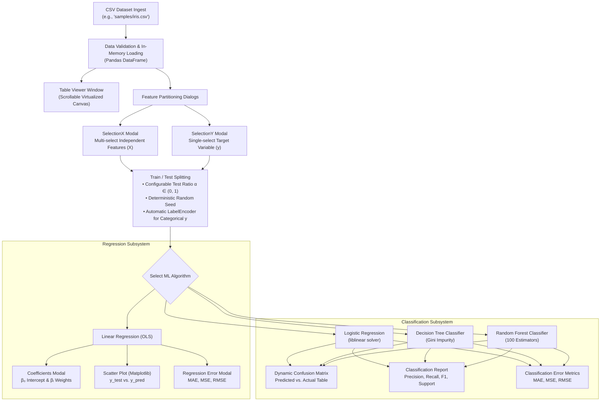

# Machine Learning Algorithm Studio

[](https://www.python.org/)
[](https://docs.python.org/3/library/tkinter.html)
[](https://scikit-learn.org/)
[](https://pandas.pydata.org/)
[](https://matplotlib.org/)
[](LICENSE)

An interactive, desktop-native Machine Learning workbench built in Python with **Tkinter**, **Scikit-Learn**, and **Matplotlib**. Designed for exploratory data analysis, interactive feature selection, automated preprocessing, and multi-model benchmarking across classical regression and classification algorithms.

The studio removes boilerplate code by providing a stateful graphical interface for dataset inspection, feature matrix partitioning, train/test splitting, model training, residual scatter plotting, dynamic confusion matrix generation, and full classification reporting.

---

## Key Highlights

- **Reactive State Machine UI**: Step-gated button states ensure rigorous pipeline ordering (`File Ingest` $\to$ `Feature Selection` $\to$ `Data Splitting` $\to$ `Model Training` $\to$ `Metric Inspection`).
- **Interactive Dual-Axis Table Viewer**: Custom virtualized canvas rendering tabular CSV data with horizontal and vertical scrollbars, zebra striping, and auto-sizing.
- **Dynamic Feature Matrix Partitioning**:
  - Independent variable ($X$) multi-selection dialog with `Select All`, `Select None`, and column checkbox toggles.
  - Dependent target variable ($y$) radio-selection modal enforcing strict mutual exclusion ($y \notin X$).
- **Integrated Machine Learning Algorithms**:
  - **Ordinary Least Squares (OLS) Linear Regression**: Intercept & coefficient inspector, Matplotlib residual scatter plots, MAE/MSE/RMSE metrics.
  - **Logistic Regression (`liblinear`)**: Multiclass and binary classification, label-encoded target restoration, dynamic confusion matrix, classification reports.
  - **Decision Tree Classifier (CART)**: Non-linear hierarchical feature splitting, Gini impurity optimization.
  - **Random Forest Classifier**: Ensemble bagging over 100 decorrelated decision trees.
- **Embedded Analytical Visualizations**: Native Matplotlib integration (`FigureCanvasTkAgg`) rendering interactive scatter plots and dynamically generated metrics grids.
- **Bundled Sample Datasets**: Includes standard benchmark datasets (`samples/iris.csv` for classification and `samples/housing.csv` for regression) for instant out-of-the-box experimentation.

---

## System Architecture & Workflow



---

## Mathematical Formulation

### 1. Ordinary Least Squares Linear Regression
Given feature matrix $\mathbf{X} \in \mathbb{R}^{n \times d}$ and target vector $\mathbf{y} \in \mathbb{R}^n$, the optimal weight vector $\hat{\boldsymbol{\beta}}$ is computed via the closed-form normal equation:
$$\hat{\boldsymbol{\beta}} = \left(\mathbf{X}^T \mathbf{X}\right)^{-1} \mathbf{X}^T \mathbf{y}$$

Predictions $\hat{\mathbf{y}} = \mathbf{X} \hat{\boldsymbol{\beta}}$ are evaluated against true values $\mathbf{y}$ using three primary residual error metrics:
$$\text{MAE} = \frac{1}{n} \sum_{i=1}^n |y_i - \hat{y}_i|$$
$$\text{MSE} = \frac{1}{n} \sum_{i=1}^n (y_i - \hat{y}_i)^2$$
$$\text{RMSE} = \sqrt{\text{MSE}} = \sqrt{\frac{1}{n} \sum_{i=1}^n (y_i - \hat{y}_i)^2}$$

---

### 2. Logistic Regression (Multinomial / OvR)
For classification with $K$ classes, class posterior probabilities are parameterized via the softmax / sigmoid link:
$$P(y = k \mid \mathbf{x}) = \frac{e^{\mathbf{w}_k^T \mathbf{x}}}{\sum_{j=1}^K e^{\mathbf{w}_j^T \mathbf{x}}}$$
The studio utilizes the coordinate descent `liblinear` solver, which optimizes the regularized negative log-likelihood:
$$\min_{\mathbf{w}} \frac{1}{2} \mathbf{w}^T \mathbf{w} + C \sum_{i=1}^n \log\left(1 + e^{-y_i \mathbf{w}^T \mathbf{x}_i}\right)$$

---

### 3. Decision Tree Classification (CART)
Recursive binary partitioning splits feature space at node $m$ using the split $\theta = (j, t_m)$ that maximizes Gini impurity reduction:
$$I_G(m) = 1 - \sum_{k=1}^K p_{mk}^2$$
$$\Delta I_G = I_G(m) - \left(\frac{N_{\text{left}}}{N_m} I_G(\text{left}) + \frac{N_{\text{right}}}{N_m} I_G(\text{right})\right)$$
where $p_{mk}$ represents the proportion of class $k$ observations in node $m$.

---

### 4. Random Forest Ensemble
Ensemble bagging constructs $B = 100$ decorrelated decision trees, each trained on a bootstrap sample $\mathcal{D}_b$ drawn with replacement from the training partition:
$$\hat{y}_{\text{ensemble}}(\mathbf{x}) = \arg\max_k \sum_{b=1}^{B} \mathbb{I}\left(\hat{y}_b(\mathbf{x}) = k\right)$$

---

### 5. Classification Performance Metrics
The studio automatically calculates class-wise and macro/weighted aggregate metrics:
$$\text{Precision}_k = \frac{TP_k}{TP_k + FP_k}, \quad \text{Recall}_k = \frac{TP_k}{TP_k + FN_k}$$
$$F_1\text{-Score}_k = 2 \cdot \frac{\text{Precision}_k \cdot \text{Recall}_k}{\text{Precision}_k + \text{Recall}_k}$$

---

## Codebase Architecture

```text
ml-algorithm-studio/
├── GUI.py                   # Main studio application & GUI state controller
│   ├── MachineLearning      # Primary window, state gating, and model orchestrator
│   ├── Table                # Virtualized dual-scrollbar tabular dataset viewer
│   ├── SelectionX           # Checkbox-driven independent feature modal
│   ├── SelectionY           # Radiobutton-driven target variable modal
│   ├── ConfusionMatrix      # Styled multi-class confusion matrix grid window
│   ├── Errors               # Residual error metrics inspector (MAE, MSE, RMSE)
│   ├── ClassificationReport # Formatted precision, recall, F1, and support table
│   ├── Scatter              # Matplotlib canvas rendering y_test vs. y_pred
│   └── Coefficients         # Intercept and per-feature coefficient inspector
├── samples/                 # Bundled validation datasets
│   ├── iris.csv             # Multi-class classification (Setosa, Versicolor, Virginica)
│   └── housing.csv          # Multivariate regression (Area, Bedrooms, Bathrooms, Price)
├── requirements.txt         # Project dependencies (pandas, scikit-learn, matplotlib, numpy)
├── .gitignore               # Python cache & IDE exclusion rules
├── py.ico                   # Application window icon
└── LICENSE                  # MIT License
```

---

## Installation & Quickstart

### Prerequisites
- Python 3.8 or higher.
- Tkinter installed (standard with standard Python distributions on Windows/macOS; on Linux: `sudo apt-get install python3-tk`).

### 1. Clone & Setup
```bash
git clone https://github.com/FortunateSpy5/ml-algorithm-studio.git
cd ml-algorithm-studio
pip install -r requirements.txt
```

### 2. Launch the Application
```bash
python GUI.py
```

---

## Step-by-Step Walkthrough

### Example A: Classification with Iris Dataset
1. **Load File**: In the `File Name` entry, enter `samples/iris.csv` and click **Select**.
2. **Preview Data**: Click **Show** to open the scrollable table view displaying all rows and column headers (`sepal_length`, `sepal_width`, `petal_length`, `petal_width`, `species`).
3. **Partition Features**:
   - Click **X**: Click **Select All**, uncheck `species`, and click **Confirm**.
   - Click **y**: Select `species` and click **Confirm**.
4. **Split Dataset**: Set `Test Size` to `0.20`, set `Random State` to `42`, and click **Split**.
5. **Train & Evaluate**:
   - Under **Random Forest**, click **Predict**.
   - Click **Confusion Matrix** to view the actual vs. predicted distribution matrix.
   - Click **Classification Report** to view class-level Precision, Recall, and F1 scores.

### Example B: Regression with Housing Dataset
1. **Load File**: In the `File Name` entry, enter `samples/housing.csv` and click **Select**.
2. **Partition Features**:
   - Click **X**: Select `area`, `bedrooms`, `bathrooms`, `stories`, and `parking`, then click **Confirm**.
   - Click **y**: Select `price` and click **Confirm**.
3. **Split Dataset**: Set `Test Size` to `0.25`, set `Random State` to `101`, and click **Split**.
4. **Train & Evaluate**:
   - Under **Linear Regression**, click **Predict**.
   - Click **Coefficients** to inspect the learned baseline bias and feature weights.
   - Click **Scatter Plot** to open the interactive Matplotlib window comparing actual test prices vs. model predictions.
   - Click **Error** to review MAE, MSE, and RMSE.

---

## License

This project is licensed under the MIT License - see the [LICENSE](LICENSE) file for details.
